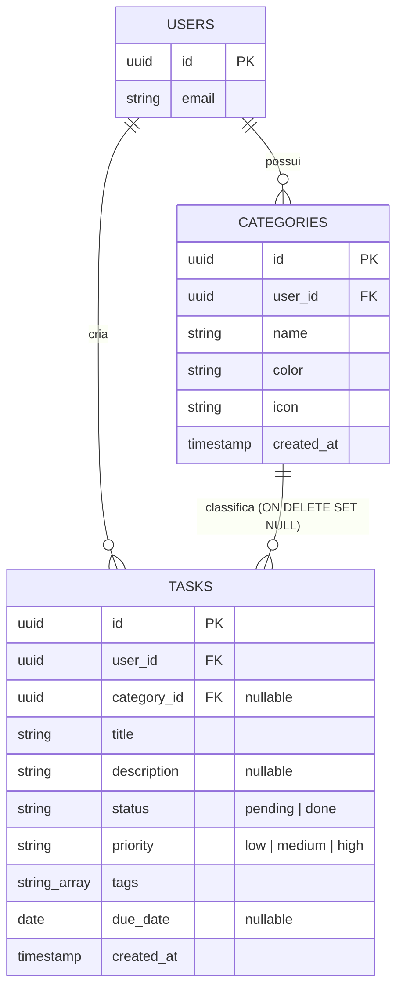

# Plano de Evolução do Modelo de Tarefas: Categorias, Prioridades e Tags (T-03, T-04, T-07)

Este documento apresenta o plano arquitetural de evolução do modelo de tarefas do **Shello**. O objetivo é prover suporte para **Categorias Dinâmicas**, **Prioridades** e **Tags**, conforme solicitado nos itens de backlog **T-03**, **T-04** e **T-07**, sem introduzir *breaking changes* para as versões existentes do aplicativo mobile.

---

## 1. Visão Geral da Arquitetura Atual vs. Proposta

Atualmente, o modelo de tarefas (`tasks`) é bastante simplista, contendo apenas: título, descrição, status, data de vencimento e metadados básicos. A evolução propõe:
1. **Prioridade**: Atributo direto da tarefa, restrito a três níveis (`low`, `medium`, `high`), com valor padrão `medium`.
2. **Tags**: Lista ordenada de strings armazenada como vetor nativo do PostgreSQL (`text[]`), ideal para consultas performáticas no Supabase.
3. **Categorias (Modelo Relacional Dinâmico)**: Uma nova tabela `categories` para que os usuários gerenciem suas próprias categorias (com nome, cor hexadecimal e ícone). A tabela `tasks` apontará para esta tabela via uma chave estrangeira opcional.



---

## 2. Script de Migração do Banco de Dados (Supabase/PostgreSQL)

O script abaixo deve ser executado no console SQL do Supabase. Ele cria a nova tabela de categorias com RLS habilitado, adiciona as colunas necessárias à tabela de tarefas, cria restrições e atualiza dados legados de maneira segura.

```sql
-- Migration: Evolve Tasks model to support categories, priority, and tags
-- ID do Backlog: T-03, T-04, T-07

BEGIN;

-- ==========================================
-- 1. Criação da Tabela de Categorias
-- ==========================================
CREATE TABLE IF NOT EXISTS public.categories (
    id UUID PRIMARY KEY DEFAULT gen_random_uuid(),
    user_id UUID NOT NULL,
    name VARCHAR(100) NOT NULL,
    color VARCHAR(7) DEFAULT '#808080' NOT NULL, -- Hexadecimal code (ex: #FF5733)
    icon VARCHAR(50), -- Identificador do ícone na biblioteca da UI
    created_at TIMESTAMP WITH TIME ZONE DEFAULT timezone('utc'::text, now()) NOT NULL,
    updated_at TIMESTAMP WITH TIME ZONE DEFAULT timezone('utc'::text, now()) NOT NULL,
    
    CONSTRAINT fk_category_user FOREIGN KEY (user_id) REFERENCES public.users(id) ON DELETE CASCADE,
    CONSTRAINT name_not_empty CHECK (char_length(trim(name)) > 0),
    CONSTRAINT valid_hex_color CHECK (color ~ '^#[0-9A-Fa-f]{6}$')
);

-- ==========================================
-- 2. Habilitação de RLS e Criação de Políticas
-- ==========================================
ALTER TABLE public.categories ENABLE ROW LEVEL SECURITY;

CREATE POLICY "Users can select their own categories" 
    ON public.categories FOR SELECT 
    USING (auth.uid() = user_id);

CREATE POLICY "Users can insert their own categories" 
    ON public.categories FOR INSERT 
    WITH CHECK (auth.uid() = user_id);

CREATE POLICY "Users can update their own categories" 
    ON public.categories FOR UPDATE 
    USING (auth.uid() = user_id) 
    WITH CHECK (auth.uid() = user_id);

CREATE POLICY "Users can delete their own categories" 
    ON public.categories FOR DELETE 
    USING (auth.uid() = user_id);

-- ==========================================
-- 3. Evolução da Tabela de Tarefas (tasks)
-- ==========================================
ALTER TABLE public.tasks 
    ADD COLUMN IF NOT EXISTS priority VARCHAR(10) DEFAULT 'medium' NOT NULL,
    ADD COLUMN IF NOT EXISTS tags TEXT[] DEFAULT '{}'::TEXT[] NOT NULL,
    ADD COLUMN IF NOT EXISTS category_id UUID;

-- Adição de restrições de chave estrangeira e domínio
ALTER TABLE public.tasks
    ADD CONSTRAINT chk_task_priority CHECK (priority IN ('low', 'medium', 'high')),
    ADD CONSTRAINT fk_task_category FOREIGN KEY (category_id) REFERENCES public.categories(id) ON DELETE SET NULL;

-- ==========================================
-- 4. Atualização e Tratamento de Dados Legados
-- ==========================================
-- Preenche registros antigos nulos se necessário
UPDATE public.tasks 
SET priority = 'medium' 
WHERE priority IS NULL;

UPDATE public.tasks 
SET tags = '{}'::TEXT[] 
WHERE tags IS NULL;

-- ==========================================
-- 5. Trigger de updated_at para Categorias
-- ==========================================
CREATE OR REPLACE FUNCTION public.handle_updated_at()
RETURNS TRIGGER AS $$
BEGIN
    NEW.updated_at = timezone('utc'::text, now());
    RETURN NEW;
END;
$$ LANGUAGE plpgsql;

CREATE OR REPLACE TRIGGER set_categories_updated_at
    BEFORE UPDATE ON public.categories
    FOR EACH ROW
    EXECUTE FUNCTION public.handle_updated_at();

COMMIT;
```

---

## 3. Alterações de Esquema (Pydantic)

As alterações devem ocorrer em dois arquivos principais: `backend/app/schemas/tasks.py` (responsável pelo tráfego da API pública CRUD) e `backend/app/models/task_models.py` (responsável pelo suporte interno e fluxo de chat).

### 3.1. Esquemas da API Pública (`backend/app/schemas/tasks.py`)

Adicionamos os novos esquemas de Categoria e estendemos os de Tarefa.

```python
# Modificações recomendadas em backend/app/schemas/tasks.py
from datetime import date
from typing import Optional, List
from pydantic import BaseModel, field_validator, Field


# ── NOVOS ESQUEMAS DE CATEGORIA ──────────────────────────────────────────────

class CategoryCreate(BaseModel):
    name: str = Field(..., min_length=1, max_length=100)
    color: str = Field(default="#808080", description="Cor em formato Hexadecimal")
    icon: Optional[str] = Field(None, max_length=50)

    @field_validator("name")
    @classmethod
    def name_not_empty(cls, value: str) -> str:
        if not value or not value.strip():
            raise ValueError("Nome da categoria não pode ser vazio.")
        return value.strip()

    @field_validator("color")
    @classmethod
    def color_valid(cls, value: str) -> str:
        import re
        if not re.match(r"^#[0-9A-Fa-f]{6}$", value):
            raise ValueError("Cor inválida. Deve seguir o formato #RRGGBB.")
        return value


class CategoryResponse(BaseModel):
    id: str
    user_id: str
    name: str
    color: str
    icon: Optional[str]
    created_at: str
    updated_at: str

    model_config = {"from_attributes": True}


# ── ESQUEMAS ATUALIZADOS DE TAREFA ───────────────────────────────────────────

VALID_STATUSES = {"pending", "done"}
VALID_PRIORITIES = {"low", "medium", "high"}


class TaskCreate(BaseModel):
    title: str
    description: Optional[str] = None
    due_date: Optional[date] = None
    priority: Optional[str] = "medium"
    tags: Optional[List[str]] = Field(default_factory=list)
    category_id: Optional[str] = None

    @field_validator("title")
    @classmethod
    def title_not_empty(cls, value: str) -> str:
        if not value or not value.strip():
            raise ValueError("Título não pode ser vazio.")
        return value.strip()

    @field_validator("priority")
    @classmethod
    def priority_valid(cls, value: Optional[str]) -> Optional[str]:
        if value is not None and value not in VALID_PRIORITIES:
            raise ValueError(f"Prioridade deve ser uma de: {VALID_PRIORITIES}")
        return value


class TaskUpdate(BaseModel):
    title: Optional[str] = None
    description: Optional[str] = None
    due_date: Optional[date] = None
    status: Optional[str] = None
    priority: Optional[str] = None
    tags: Optional[List[str]] = None
    category_id: Optional[str] = None

    @field_validator("status")
    @classmethod
    def status_valid(cls, value: Optional[str]) -> Optional[str]:
        if value is not None and value not in VALID_STATUSES:
            raise ValueError(f"Status deve ser um de: {VALID_STATUSES}")
        return value

    @field_validator("priority")
    @classmethod
    def priority_valid(cls, value: Optional[str]) -> Optional[str]:
        if value is not None and value not in VALID_PRIORITIES:
            raise ValueError(f"Prioridade deve ser uma de: {VALID_PRIORITIES}")
        return value


class TaskResponse(BaseModel):
    id: str
    user_id: str
    title: str
    description: Optional[str]
    due_date: Optional[date]
    status: str
    is_overdue: bool
    priority: str
    tags: List[str]
    category_id: Optional[str]
    category: Optional[CategoryResponse] = None  # Resolução aninhada
    created_at: str
    updated_at: str
```

### 3.2. Modelos Internos e Chat (`backend/app/models/task_models.py`)

Garante que tarefas criadas através do pipeline de IA (Chat) se adequem aos novos tipos.

```python
# Modificações recomendadas em backend/app/models/task_models.py
from __future__ import annotations
from pydantic import BaseModel, Field
from typing import Optional, List
from datetime import date


class TaskCreate(BaseModel):
    title: str = Field(..., min_length=1, max_length=200, description="Título da tarefa.")
    due_date: Optional[date] = Field(None, description="Data de vencimento.")
    priority: str = Field("medium", description="Prioridade (low, medium, high)")
    tags: List[str] = Field(default_factory=list, description="Lista de tags")
    category_id: Optional[str] = Field(None, description="ID da categoria associada")


class TaskFromChatSingle(BaseModel):
    title: str = Field(..., min_length=1, max_length=200)


class TaskFromChatBatch(BaseModel):
    tasks: list[TaskFromChatSingle] = Field(..., min_length=1, max_length=3)


class Task(BaseModel):
    id: str
    user_id: str
    title: str
    status: str = "pending"
    due_date: Optional[date] = None
    priority: str = "medium"
    tags: List[str] = Field(default_factory=list)
    category_id: Optional[str] = None

    model_config = {"from_attributes": True}
```

---

## 4. Evolução do Contrato da API

Para integrar as melhorias de maneira retrocompatível, o payload das requisições receberá novos campos opcionais.

### 4.1. `GET /api/tasks`
Retorna a lista de tarefas agregando detalhes da categoria se disponível.

**Response Exemplo (200 OK):**
```json
[
  {
    "id": "7a7cfbd2-6ff3-4bde-a39c-c90a184e60df",
    "user_id": "user-1",
    "title": "Comprar mantimentos",
    "description": "Focar em frutas e verduras frescas",
    "due_date": "2026-06-20",
    "status": "pending",
    "is_overdue": false,
    "priority": "high",
    "tags": ["mercado", "saúde"],
    "category_id": "c138f29d-4be9-450b-93ff-183faef4718f",
    "category": {
      "id": "c138f29d-4be9-450b-93ff-183faef4718f",
      "user_id": "user-1",
      "name": "Casa",
      "color": "#00FF7F",
      "icon": "home",
      "created_at": "2026-06-15T02:00:00Z",
      "updated_at": "2026-06-15T02:00:00Z"
    },
    "created_at": "2026-06-15T02:10:00Z",
    "updated_at": "2026-06-15T02:10:00Z"
  }
]
```

### 4.2. `POST /api/tasks`
Criação com campos opcionais de classificação.

**Request Exemplo (201 Created):**
```json
{
  "title": "Estudar arquitetura de banco de dados",
  "description": "Focar no funcionamento de RLS",
  "due_date": "2026-06-16",
  "priority": "medium",
  "tags": ["estudos", "backend"],
  "category_id": "ea49a1bf-4a3c-41c3-b9be-683a4ebff2cf"
}
```

> [!WARNING]
> Se a requisição de criação omitir os novos campos (como ocorre nas requisições da versão atual do app mobile), o backend aplicará implicitamente:
> - `priority`: `"medium"`
> - `tags`: `[]`
> - `category_id`: `null`

---

## 5. Implementação das Camadas de Serviço e Repositório

### 5.1. Repositório de Tarefas (`backend/app/repositories/task_repository.py`)
Adição de suporte para buscar de forma aninhada a categoria correspondente e injetar campos novos.

```python
# Modificações nos selects do Repositório
class TaskRepository:
    # ...
    
    # Campo select base para consultas
    SELECT_FIELDS = (
        "id, user_id, title, description, due_date, status, created_at, updated_at, "
        "priority, tags, category_id, "
        "category:categories(id, user_id, name, color, icon, created_at, updated_at)"
    )

    def list_by_user(self, user_id: str, status: str | None = None) -> list[dict]:
        try:
            query = (
                self._client.table("tasks")
                .select(self.SELECT_FIELDS)
                .eq("user_id", user_id)
            )
            if status:
                query = query.eq("status", status)
            result = query.order("created_at", desc=True).execute()
            return result.data
        except Exception:
            logger.error("Erro ao listar tarefas: user_id=%s", user_id)
            raise

    def get_by_id(self, task_id: str, user_id: str) -> dict | None:
        try:
            result = (
                self._client.table("tasks")
                .select(self.SELECT_FIELDS)
                .eq("id", task_id)
                .eq("user_id", user_id)
                .limit(1)
                .execute()
            )
            return result.data[0] if result.data else None
        except Exception:
            logger.error("Erro ao buscar tarefa: task_id=%s", task_id)
            raise

    def create(self, user_id: str, title: str, description: str | None, due_date: str | None,
               priority: str = "medium", tags: list[str] = None, category_id: str | None = None) -> dict:
        try:
            payload = {
                "user_id": user_id,
                "title": title,
                "description": description,
                "due_date": due_date,
                "status": "pending",
                "priority": priority,
                "tags": tags or [],
                "category_id": category_id
            }
            # Remove chaves com None para utilizar valores padrão do banco
            payload = {k: v for k, v in payload.items() if v is not None}

            result = self._client.table("tasks").insert(payload).execute()
            if not result.data:
                raise RuntimeError("Inserção retornou dados vazios.")
            
            # Recarrega a tarefa para incluir o relacionamento aninhado de categoria
            return self.get_by_id(result.data[0]["id"], user_id)
        except Exception:
            logger.error("Erro ao criar tarefa")
            raise
```

### 5.2. Regras de Negócio e Segurança no Serviço (`backend/app/services/task_service.py`)

A regra de segurança mais importante é garantir que o usuário não tente associar a tarefa a uma categoria que pertença a outro usuário (*Cross-Tenant Attack*).

```python
# Adaptações nas validações em backend/app/services/task_service.py
class TaskService:
    # ...
    
    def create_task(self, user_id: str, data: TaskCreate) -> dict:
        # Validação cruzada de tenant para categorias
        if data.category_id:
            self._validate_category_ownership(data.category_id, user_id)

        due_date_str = data.due_date.isoformat() if data.due_date else None
        task = self._repo.create(
            user_id=user_id,
            title=data.title,
            description=data.description,
            due_date=due_date_str,
            priority=data.priority or "medium",
            tags=data.tags or [],
            category_id=data.category_id
        )
        return self._enrich_task(task)

    def update_task(self, task_id: str, user_id: str, data: TaskUpdate) -> dict:
        if data.category_id:
            self._validate_category_ownership(data.category_id, user_id)

        fields = {}
        if data.title is not None:
            fields["title"] = data.title
        if data.description is not None:
            fields["description"] = data.description
        if data.due_date is not None:
            fields["due_date"] = data.due_date.isoformat()
        if data.status is not None:
            fields["status"] = data.status
        if data.priority is not None:
            fields["priority"] = data.priority
        if data.tags is not None:
            fields["tags"] = data.tags
        if data.category_id is not None:
            fields["category_id"] = data.category_id

        if not fields:
            raise ValueError("Nenhum campo para atualizar.")

        task = self._repo.update(task_id, user_id, fields)
        if not task:
            raise ValueError("Tarefa não encontrada.")
        
        # Como o update normal não faz fetch com joins, buscamos novamente com get_by_id
        return self.get_task(task_id, user_id)

    def _validate_category_ownership(self, category_id: str, user_id: str) -> None:
        """Garante que a categoria referenciada pertence ao próprio usuário."""
        # Assume-se a injeção ou consulta direta a um repositório de categorias
        category = self._repo.client.table("categories").select("id").eq("id", category_id).eq("user_id", user_id).execute()
        if not category.data:
            raise ValueError("A categoria informada é inválida ou não pertence a este usuário.")
```

---

## 6. Análise de Impacto e Retrocompatibilidade

### 6.1. Impacto no Usuário Final e Contrato do App Mobile
A mudança proposta garante **100% de compatibilidade reversa**:
- A ausência de parâmetros novos (`category_id`, `priority`, `tags`) durante o payload de criação ou edição é tratada no Pydantic usando defaults seguros (`"medium"`, `[]`, `None`).
- O retorno da API continua enviando os campos antigos (`id`, `title`, `description`, `due_date`, `status`, etc.) na mesma estrutura de antes.
- O campo `category` aninhado será nulo por padrão para todas as tarefas antigas.

### 6.2. Proteção contra Falhas de Segurança (RLS e Validação de IDs)
1. **Políticas de RLS (Supabase)**: A nova tabela de categorias tem RLS explícito (`auth.uid() = user_id`). Qualquer tentativa direta de um usuário malicioso de consultar as categorias de outro falhará imediatamente no banco de dados.
2. **Validação na Camada de Serviço**: No backend, o `TaskService` realiza a validação de ownership da categoria (`_validate_category_ownership`) antes de atualizar ou salvar qualquer tarefa. Isso impede que um usuário associe tarefas a categorias de outros usuários, mesmo que saibam o ID UUID.

### 6.3. Desempenho e Paginação
- O uso de `TEXT[]` para tags simplifica a modelagem evitando tabelas de associação pivot (*many-to-many*). Consultas como "Tarefas contendo a tag X" são indexáveis e performáticas através de índices GIN no PostgreSQL:
  ```sql
  CREATE INDEX idx_tasks_tags ON public.tasks USING gin (tags);
  ```
- O select aninhado com `categories` é otimizado pelo motor PostgREST do Supabase e converte a junção em uma única consulta SQL no PostgreSQL, evitando o problema clássico de requisições de N+1 consultas.
