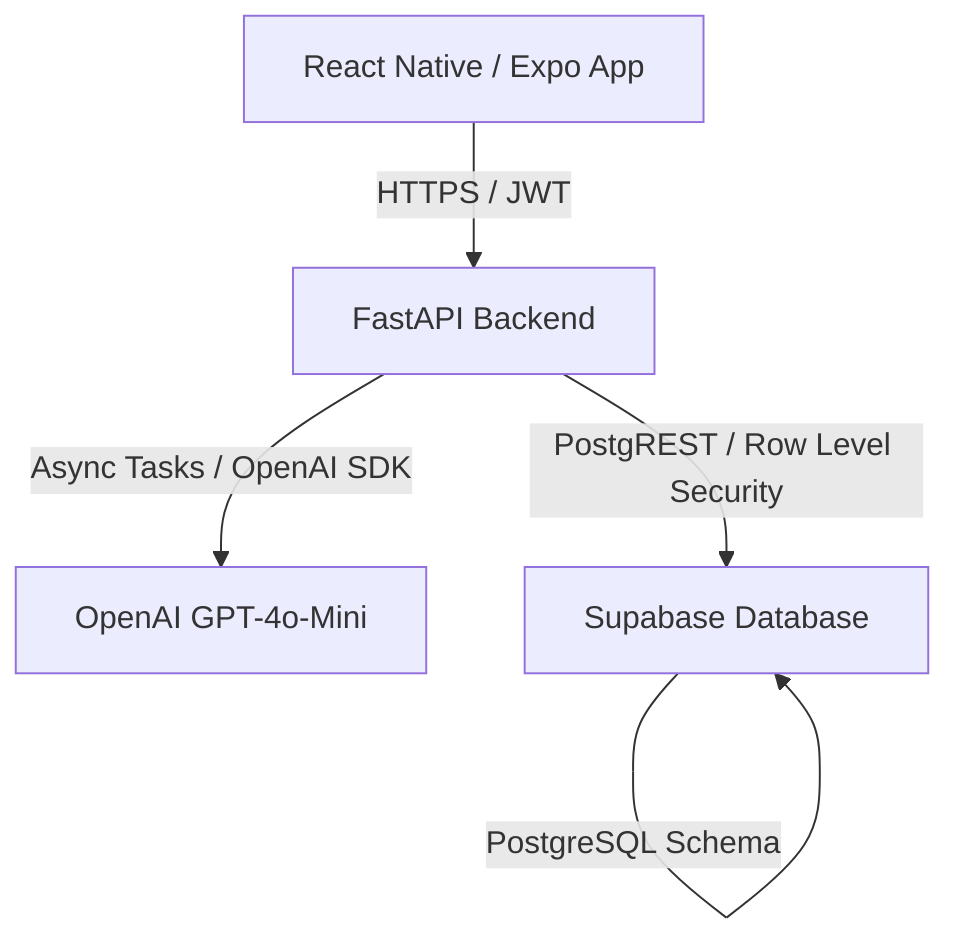

# 🌿 CONTEXTO COMPLETO DO PROJETO — SHELLO (BACK-END, BANCO & ALINHAMENTO FRONT-END)

Este documento centraliza todo o conhecimento técnico, arquitetura de banco de dados, regras de negócio do back-end e rotas de API do projeto **Shello v2**. Ele serve como guia definitivo para alinhar a implementação do front-end React Native (Expo) com a API FastAPI real e o banco Supabase (PostgreSQL).

---

## 1. Visão Geral da Arquitetura do Sistema

O Shello é um assistente pessoal inteligente projetado para auxiliar na organização diária, reflexão pessoal e produtividade do usuário.



- **Mascote Oficial:** A tartaruga Shello (expressões: *neutro*, *duvidoso*, *surpreso*, *feliz*).
- **Back-end:** FastAPI (Python 3.12) estruturado em camadas MVC (Controllers, Services, Repositories, Models).
- **Banco de Dados:** Supabase PostgreSQL com políticas de isolamento de usuário em nível de linha (Row Level Security - RLS).
- **Provedor de IA:** OpenAI GPT-4o-Mini (versão fixada: `gpt-4o-mini-2024-07-18`, temperatura `0.7`).
- **Front-end:** React Native + Expo + TypeScript, estilizado com base no tema Sage (`ShelloTema`) usando `StyleSheet.create`.

---

## 2. Dicionário de Dados & Mapeamento do Banco de Dados

Todas as tabelas no Supabase possuem RLS ativado com a política `user_isolation` baseada em `user_id = auth.uid()`. Isso garante que nenhum usuário consiga visualizar, atualizar ou deletar dados de outro.

### 2.1. Tabela `users`
Armazena o perfil, preferências do agente e estado de sincronização visual.
- **`id`** (`uuid`): Chave primária (corresponde ao `auth.uid()` do Supabase).
- **`email`** (`varchar(255)`): Único.
- **`name`** (`varchar(100)`): Nome completo informado no cadastro.
- **`formalidade`** (`varchar(10)`): Default `'media'`. Restrito por CHECK: `['baixa', 'media', 'alta']`.
- **`nome_referencia`** (`varchar(30)`): Default `''`. Como o Shello chama o usuário nas respostas (ex: "Alex", "Edu").
- **`theme`** (`varchar(5)`): Default `'light'`. Restrito por CHECK: `['light', 'dark']`.
- **`onboarding_done`** (`boolean`): Default `false`. Define se o fluxo inicial foi concluído.
- **`created_at`** (`timestamptz`): Data de criação da conta.

### 2.2. Tabela `diary_entries`
Contém as notas do diário de reflexão pessoal escritas pelo usuário.
- **`id`** (`uuid`): Chave primária.
- **`user_id`** (`uuid`): FK -> `users.id` (ON DELETE CASCADE).
- **`content`** (`text`): Texto da anotação (deve possuir comprimento $> 0$).
- **`created_at`** (`timestamptz`): Data e hora de criação.
- **`updated_at`** (`timestamptz`): Data e hora de edição.
- *Índices:* Busca rápida por data (`idx_diary_user_date`) e busca textual utilizando `tsvector` português.

### 2.3. Tabela `tasks`
Gerenciamento de tarefas do ToDo list do usuário.
- **`id`** (`uuid`): Chave primária.
- **`user_id`** (`uuid`): FK -> `users.id` (ON DELETE CASCADE).
- **`title`** (`varchar(255)`): Título da tarefa (comprimento $> 0$).
- **`description`** (`text`): Detalhes opcionais da tarefa.
- **`due_date`** (`date`): Data de vencimento opcional. **Atenção:** Sempre criada como `null` se gerada a partir do chat.
- **`status`** (`varchar(10)`): Default `'pending'`. Restrito por CHECK: `['pending', 'done']`.
- **`created_at`** (`timestamptz`).
- **`updated_at`** (`timestamptz`).

### 2.4. Tabela `conversations`
Sessões de conversa mantidas com o assistente Shello.
- **`id`** (`uuid`): Chave primária.
- **`user_id`** (`uuid`): FK -> `users.id` (ON DELETE CASCADE).
- **`status`** (`varchar(10)`): Default `'active'`. Restrito por CHECK: `['active', 'archived']`.
- **`context_suggested`** (`boolean`): Default `false`.
- **`message_count`** (`integer`): Default `0`. Contador de mensagens da conversa (máx. 20).
- **`last_message_at`** (`timestamptz`): Timestamp da última mensagem trafegada.
- **`created_at`** (`timestamptz`).

### 2.5. Tabela `messages`
Mensagens individuais pertencentes a uma conversa.
- **`id`** (`uuid`): Chave primária.
- **`conversation_id`** (`uuid`): FK -> `conversations.id` (ON DELETE CASCADE).
- **`user_id`** (`uuid`): FK -> `users.id`.
- **`role`** (`varchar(10)`): Restrito por CHECK: `['user', 'assistant']`.
- **`content`** (`text`): Texto da mensagem.
- **`created_at`** (`timestamptz`).
- *Índices:* Ordenação rápida por data dentro da conversa (`idx_messages_conv_date`).

### 2.6. Tabela `context_fragments` (Memória de Contexto)
Fragmentos de fatos ou preferências extraídos por IA para o cérebro/contexto do Shello.
- **`id`** (`uuid`): Chave primária.
- **`user_id`** (`uuid`): FK -> `users.id` (ON DELETE CASCADE).
- **`content`** (`varchar(300)`): Fato ou preferência extraída (deve ter comprimento $> 0$).
- **`category`** (`varchar(20)`): Restrito por CHECK: `['preferencia', 'fato', 'objetivo', 'restricao']`.
- **`is_active`** (`boolean`): Default `true` no banco, porém **salvo como `false` quando derivado de extração automática** até que o usuário ative ou valide.
- **`derived_from_conversation_id`** (`uuid`): FK -> `conversations.id` (ON DELETE SET NULL).
- **`created_at`** (`timestamptz`).

### 2.7. Tabela `onboarding_answers`
Respostas obtidas no onboarding inicial do usuário.
- **`id`** (`uuid`): Chave primária.
- **`user_id`** (`uuid`): FK -> `users.id` (ON DELETE CASCADE) - Único por usuário.
- **`q1_name`** (`varchar(30)`): Nome preferido do usuário.
- **`q2_lifestyle`** (`varchar(100)`): Descrição livre do estilo de vida.
- **`q3_goal`** (`varchar(100)`): Meta principal do usuário.
- **`completed_at`** (`timestamptz`).

---

## 3. Mapeamento Completo de Rotas da API REST

A API do Shello requer autenticação por token JWT no cabeçalho `Authorization: Bearer <token>` para todas as rotas (exceto healthcheck e rotas de login/registro).

### 3.1. Autenticação & Onboarding (`tags=["Auth"]`)
- **`POST /auth/register`**
  - Cadastro de novo usuário.
  - Retorna o usuário criado.
- **`POST /auth/login`**
  - Autenticação por email e senha.
  - Retorna o token JWT e salva o cookie HTTPOnly.
- **`POST /auth/logout`**
  - Invalida a sessão atual.
- **`POST /auth/onboarding`**
  - Envia as respostas estruturadas das perguntas de estilo de vida e metas.
  - Body: `{"q1_name": str, "q2_lifestyle": str, "q3_goal": str}`
  - Define `onboarding_done = true` no perfil do usuário.

### 3.2. Diário (`tags=["Diário"]`)
- **`POST /api/diary`**
  - Cria uma nova anotação.
  - Body: `{"content": "Texto da anotação..."}` (máx. 10.000 caracteres).
  - **Regra de Ouro:** Se `content` tiver mais de 100 caracteres, o backend dispara uma **extração assíncrona** (`asyncio.create_task`) que chama a LLM para minerar fatos sem travar a resposta do usuário.
- **`GET /api/diary`**
  - Lista de notas paginadas do usuário (`?page=1&page_size=20`).
  - Retorna agrupamento lógico ou itens com o campo auxiliar `date_group` (`YYYY-MM-DD`).
- **`GET /api/diary/search?q=termo`**
  - Busca notas antigas que contenham a palavra-chave usando busca `ILIKE` textual.
- **`PUT /api/diary/{entry_id}`**
  - Atualiza o conteúdo de uma anotação existente (valida se o usuário é proprietário, se não for retorna HTTP 403).
- **`DELETE /api/diary/{entry_id}`**
  - Deleta a anotação (valida propriedade - HTTP 403).

### 3.3. Chat do Agente Shello (`tags=["Chat"]`)
- **`POST /api/chat`**
  - Envia uma mensagem ao Shello e obtém a resposta processada por IA.
  - Body: `{"message": "Texto do usuário...", "conversation_id": Optional[str]}`
  - **Lógica e Resposta:**
    - Se a conversa ativa possuir mais de 20 mensagens, retorna `HTTP 400` com erro de limite.
    - O backend realiza uma análise léxica rápida da mensagem para definir o **Modo**: `"PRATICO"` ou `"PADRAO"`.
    - Constrói o Prompt de 6 Blocos (Identidade do Shello, Parâmetros, Fragmentos de Contexto do Usuário, Modo Ativo, Histórico de Mensagens truncado a 1.500 tokens e a Mensagem Atual).
    - O retorno da API segue o formato:
      ```json
      {
        "response": "Resposta em texto gerada pelo Shello...",
        "mode": "PRATICO | PADRAO",
        "blocked": false,
        "conversation_id": "uuid-da-conversa",
        "message_count": 5,
        "suggest_task": {
          "title": "Título sugerido da tarefa",
          "due_date": null
        }
      }
      ```
    - Se o modo for `"PRATICO"`, o objeto `suggest_task` virá populado, o que avisa o frontend para exibir o **Card de Confirmação** de tarefa.
- **`GET /api/chat/conversations`**
  - Lista as conversas do usuário.
- **`DELETE /api/chat/conversations/{id}`**
  - Arquiva a conversa (muda status de `active` para `archived`).

### 3.4. Gestão de Tarefas (`tags=["Tarefas"]`)
- **`POST /api/tasks`**
  - Criação manual de tarefas.
  - Body: `{"title": "Título...", "description": "...", "due_date": "YYYY-MM-DD"}`
- **`GET /api/tasks?status=pending|done`**
  - Lista tarefas pendentes ou concluídas do usuário.
- **`PUT /api/tasks/{id}`**
  - Edita campos (título, descrição, data de vencimento) de uma tarefa.
- **`PATCH /api/tasks/{id}/status`**
  - Alterna rapidamente o estado da tarefa entre `pending` e `done`.
- **`DELETE /api/tasks/{id}`**
  - Remove uma tarefa.
- **`POST /api/tasks/from-chat`**
  - **Crucial:** Chamado pelo frontend quando o usuário clica em `[Confirmar]` no card de sugestão de tarefa gerado no chat.
  - Aceita formato simples (única tarefa) ou lote (até 3 tarefas para comandos complexos):
    - Único: `{"title": "Comprar pão"}`
    - Lote: `{"tasks": [{"title": "Tarefa 1"}, {"title": "Tarefa 2"}]}`
  - **Atenção:** `due_date` é sempre setado como `null` (de acordo com as regras de negócio do MVP).

### 3.5. Painel de Contexto (`tags=["Contexto"]`)
- **`GET /api/context`**
  - Retorna os fragmentos de contexto (`context_fragments`) extraídos pela IA organizados por categoria.
- **`DELETE /api/context/{id}`**
  - Remove permanentemente um fato/memória da IA sobre o usuário.

### 3.6. Configurações (`tags=["Configurações"]`)
- **`GET /api/users/me`**
  - Retorna os dados completos do usuário autenticado (incluindo onboarding e preferências).
- **`PUT /api/users/preferences`**
  - Atualiza as preferências do assistente.
  - Body:
    ```json
    {
      "formalidade": "baixa | media | alta",
      "nome_referencia": "Como o usuário quer ser chamado",
      "theme": "light | dark"
    }
    ```
- **`PUT /api/users/password`**
  - Altera a senha do usuário logado.
  - Body: `{"current_password": "senha_atual", "new_password": "nova_senha_min_8_chars"}`

### 3.7. Histórico Unificado (`tags=["Histórico"]`)
- **`GET /api/history`**
  - Retorna a junção lógica de diários e conversas antigas ordenada por data decrescente (`created_at DESC`).
  - Query Params:
    - `?type=conversation` (filtra apenas conversas)
    - `?type=diary` (filtra apenas notas)
    - `?q=palavra` (busca por termo)
    - `?page=1&page_size=20`
  - Resposta paginada padrão:
    ```json
    {
      "items": [
        {
          "id": "uuid",
          "type": "conversation | diary",
          "preview": "Trecho inicial com 120 caracteres...",
          "created_at": "ISO-TIMESTAMP",
          "item_count": 10 // quantidade de palavras (diário) ou mensagens (chat)
        }
      ],
      "total": 45,
      "page": 1,
      "page_size": 20,
      "has_more": true
    }
    ```

---

## 4. Regras de Negócio Cruciais para o Alinhamento Front-End

Para elevar a fidelidade do front-end e sincronizá-lo com o backend real, as seguintes regras devem ser respeitadas nos componentes visuais:

### 4.1. Limite de 20 Mensagens no Chat
- **Backend:** Retorna `HTTP 400` ao tentar enviar mensagem em conversa ativa com $\ge 20$ mensagens.
- **Frontend (Aprimoramento):**
  - Ler o campo `message_count` retornado em cada post de mensagem.
  - Ao atingir 20 mensagens, bloquear o input de texto do chat (`disabled={true}`) e exibir uma mensagem amigável no topo ou rodapé: *"Você atingiu o limite de 20 mensagens nesta conversa. Inicie uma nova conversa para continuar."*
  - Exibir um botão proeminente de **"Novo Chat"** que limpa o identificador de conversa e inicia um fluxo limpo.

### 4.2. Fluxo de Confirmação de Tarefa
- **Comportamento:** Ao receber a resposta da IA com `suggest_task` no body, exibir um card estilizado e arredondado na base do balão de chat da IA.
- **Botão `[Confirmar]`:** Deve realizar um request para `POST /api/tasks/from-chat` passando o título proposto. Ao obter sucesso, remover o card de confirmação de tela e adicionar uma animação na aba de Tarefas indicando o novo item.
- **Botão `[Cancelar]`:** Apenas descarta o card localmente.

### 4.3. Detecção de Fatos no Diário
- **Comportamento:** Ao salvar uma nota com mais de 100 caracteres no diário, a API do backend retorna instantaneamente `HTTP 201`. Internamente, a IA começa a rodar a extração.
- **Frontend (Aprimoramento):**
  - O aplicativo não precisa travar a tela em loading demorado. Exiba um feedback visual sutil na nota de que a IA está "lendo" ou processando em background.
  - Quando o usuário acessar a tela de Perfil (`ProfileScreen`), ele verá novos fragmentos de contexto surgindo.

### 4.4. Regras de Personalidade (Formalidade e Nome de Referência)
- **Comportamento:** Alterar a formalidade para "baixa", "média" ou "alta" e mudar o nome de referência no Perfil deve chamar instantaneamente a rota `PUT /api/users/preferences`.
- **Frontend (Aprimoramento):**
  - O ChatService e o prompt interno da IA lerão essas preferências diretamente no banco de dados na próxima mensagem. A tartaruga Shello mudará o tom das respostas imediatamente (vocabulário mais formal ou mais descontraído).

---

## 5. Plano de Migração: Mock para API Real

O front-end foi construído usando uma estratégia de **Front-end First** com `mockServicos.ts` salvando localmente em `AsyncStorage` com `setTimeout`. Para plugar a API real:

```
[Componente React]
       │
       ▼
[ShelloContext.tsx] (Centralizador de Estado)
       │
 ┌─────┴────────────────────────┐
 │ (MOCK ANTES)                 │ (REAL DEPOIS)
 ▼                              ▼
[mockServicos.ts]             [api.ts / Axios ou Fetch]
 └─────┬────────────────────────┘
       ▼
[AsyncStorage]                 [FastAPI Backend / JWT]
```

### 5.1. Mapeamento de Tipos
Substitua ou mapeie as chaves do front-end com os retornos do back-end real:

| Interface Front-end (`types/index.ts`) | Tipo do Banco/API Backend (`Pydantic Models`) | Mapeamento de Atributos |
| :--- | :--- | :--- |
| **`EntradaDiario`** | `DiaryEntry` | `id`, `titulo` (pode ser mapeado para os primeiros 30 chars de content), `conteudo` $\rightarrow$ `content`, `dataCriacao` $\rightarrow$ `created_at` |
| **`Tarefa`** | `Task` | `id`, `titulo` $\rightarrow$ `title`, `descricao` $\rightarrow$ `description`, `concluida` $\rightarrow$ `status == 'done'`, `data` $\rightarrow$ `due_date` |
| **`MemoriaIA`** | `ContextFragment` | `id`, `conteudo` $\rightarrow$ `content`, `tipo` $\rightarrow$ `category.toUpperCase()`, `dataCriacao` $\rightarrow$ `created_at` |
| **`DadosOnboarding`** | `OnboardingAnswers` | `nome` $\rightarrow$ `q1_name`, `estiloDeVida` $\rightarrow$ `q2_lifestyle`, `metaAtual` $\rightarrow$ `q3_goal` |
| **`MensagemChat`** | `Message` | `id`, `remetente` $\rightarrow$ `role` (`'user'` ou `'assistant'`), `conteudo` $\rightarrow$ `content`, `horario` $\rightarrow$ formatar `created_at` |

### 5.2. Exemplo de Adaptação do `ShelloContext.tsx`
Para migrar o carregamento inicial de dados (antigo `useEffect` com mocks) para chamadas reais, estruture da seguinte forma usando a rota unificada e de listagens autenticadas:

```typescript
// Exemplo de chamada real de sincronização em ShelloContext
const carregarDadosReais = async (token: string) => {
  try {
    const cabecalho = { 'Authorization': `Bearer ${token}` };
    
    const [userRes, diaryRes, tasksRes, contextRes] = await Promise.all([
      fetch(`${API_URL}/api/users/me`, { headers: cabecalho }).then(r => r.json()),
      fetch(`${API_URL}/api/diary`, { headers: cabecalho }).then(r => r.json()),
      fetch(`${API_URL}/api/tasks`, { headers: cabecalho }).then(r => r.json()),
      fetch(`${API_URL}/api/context`, { headers: cabecalho }).then(r => r.json())
    ]);

    setNomeUsuario(userRes.nome_referencia || userRes.name);
    setNivelFormalidade(userRes.formalidade);
    setOnboardingConcluido(userRes.onboarding_done);
    
    // Mapeamento de itens
    setEntradas(diaryRes.items.map((e: any) => ({
      id: e.id,
      titulo: e.content.slice(0, 30) + '...',
      conteudo: e.content,
      dataCriacao: e.created_at,
      adicionadaAoContexto: e.date_group !== null
    })));

    setTarefas(tasksRes.map((t: any) => ({
      id: t.id,
      titulo: t.title,
      concluida: t.status === 'done',
      data: t.due_date,
      dataCriacao: t.created_at
    })));

    setMemorias(contextRes.map((c: any) => ({
      id: c.id,
      tipo: c.category.toUpperCase(),
      conteudo: c.content,
      dataCriacao: c.created_at
    })));
  } catch (error) {
    console.error("Erro ao sincronizar com API real:", error);
  }
};
```

---

## 6. Símbolos, Identidade e Guia de Design (Tokens de UI/UX)

Para garantir que o front-end mantenha o refinamento premium esperado:
- **Cor de Fundo:** `#F7F6F0` (Creme/Off-white suave) é o canvas de fundo. Dá o ar de "papel texturizado/orgânico" e reduz cansaço ocular.
- **Verde Sálvia (`#5E836A`):** Deve ser usado pontualmente em elementos interativos, botões principais de ação e na marcação de progresso, evitando a saturação da tela.
- **Tipografia Serifada nos Cabeçalhos:** Essencial para trazer o tom meditativo e calmo. No React Native, utilize `fontFamily: 'serif'` ou configure fontes customizadas via Expo Fonts.
- **Cantos Arredondados Extremos (`borderRadius: 24` ou `32`):** Passam a sensação de conforto e acolhimento (Cards e Containers).
- **Animações no Chat e Diário:** O ShimmerLoader no chat simula a tartaruga Shello "pensando". Mantenha animações fluidas e evite travamento de tela em loading.

Este alinhamento técnico fornece toda a fundamentação para a transição transparente de dados simulados para a API produtiva em Supabase.
