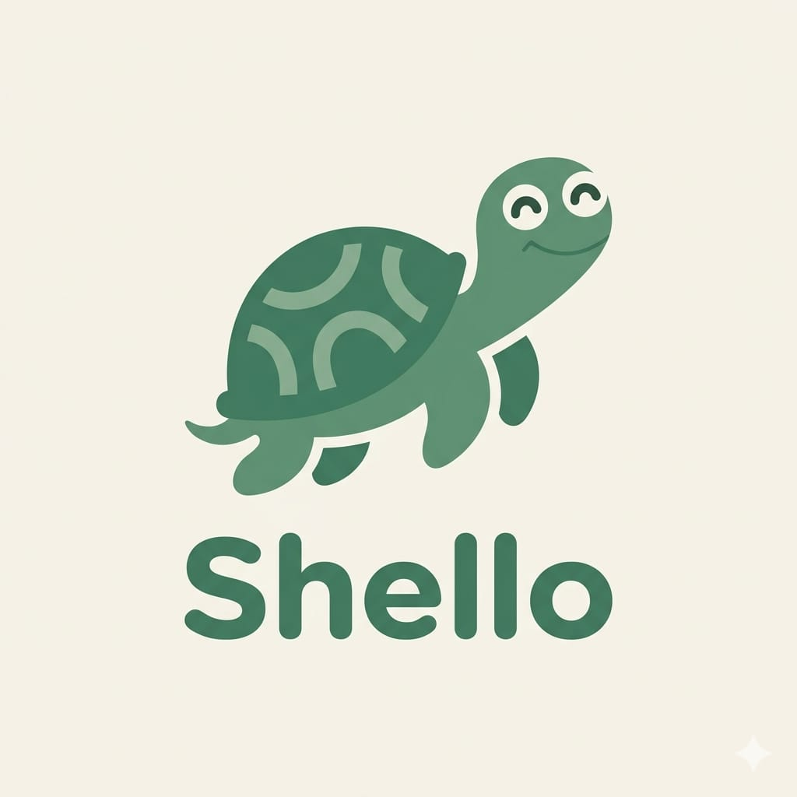

# 🎨 DIRETRIZES VISUAIS & ESPECIFICAÇÕES DE UI/UX — SHELLO

Este documento serve como referência de design para o front-end móvel do aplicativo **Shello**. Ele define a identidade visual, tipografia, paleta de cores e comportamento detalhado de experiência do usuário (UX) para cada tela.

---

## 🐢 1. Identidade Visual & Logo

O mascote oficial do projeto é a tartaruga **Shello**. A logo oficial está localizada na raiz do projeto:



---

## 🎨 2. Design Tokens (Sage Theme)

Toda a estilização deve seguir estritamente os tokens abaixo para garantir uma estética minimalista, orgânica e relaxante.

### Paleta de Cores (Definida em `src/styles/theme.ts`)

| Token | Valor Hex | Descrição |
| :--- | :--- | :--- |
| **`background`** | `#F7F6F0` | Creme/Off-white suave para o fundo geral do app |
| **`surface`** | `#FFFFFF` | Branco puro para cards de conteúdo, inputs e modais |
| **`textPrimary`** | `#2D3A32` | Verde floresta escuro para títulos e textos principais |
| **`textSecondary`** | `#6C757D` | Cinza neutro para legendas, placeholders e metadados |
| **`brandPrimary`** | `#5E836A` | Verde Sálvia oficial da tartaruga Shello |
| **`brandLight`** | `#D6E2D8` | Verde clarinho para badges ativos (ex: streaks) |
| **`accentTerracota`** | `#EADCD6` | Salmão/Terracota suave para CTAs secundários e botões |
| **`error`** | `#DC3545` | Vermelho padrão para sinalização de atrasos ou exclusões |

### Tipografia (Nativa Android & Custom Serif)

Para obter alta performance e um design extremamente premium, orgânico e relaxante, a tipografia combina duas famílias:

* **Títulos Principais, Títulos de Seções e Saudações:** Serifada (ex: `serif` nativa no Android ou fonte customizada elegante como `Playfair Display` ou `Roboto Slab`), cor `textPrimary` com peso regular ou bold de acordo com o destaque.
* **Corpo de Texto (Notas/Chat), Legendas, Badges e Inputs:** Sans-serif nativa `Roboto` (Regular/Medium/Bold).
  - Corpo de texto aplica obrigatoriamente `lineHeight: 22` para conforto ocular em leituras longas.
  - Badges e legendas utilizam `Roboto-Medium` (12px) com estilo sutil e espaçamento de letras adequado.

### Ícones

* **Biblioteca Padrão:** `@expo/vector-icons` utilizando exclusivamente a família **Feather** ou **Lucide** para traços finos, limpos e modernos que harmonizam com o tema orgânico.

### Formas e Espaçamento

* **Estilo de Estilização:** CSS-in-JS está proibido. Use a API `StyleSheet.create` padrão do React Native.
* **Cantos Arredondados:** Cards principais e botões devem possuir cantos muito arredondados para passar um ar orgânico e suave (`borderRadius: 24` ou `borderRadius: 32`).
* **Paddings & Margens:** Espaçamentos generosos (padrão `16px` a `24px`) para evitar sensação de telas apertadas ou sobrecarregadas de informação.

---

## 🏗️ 3. Arquitetura de Estado e Dados Mockados

Para dar suporte ao **Front-end First com dados mockados**:

1. **Camada de Serviços (`src/services/`):**
   - Toda leitura/escrita de dados (diário, tarefas, memórias, perfil) deve ocorrer por funções assíncronas em arquivos na pasta `src/services/`.
   - Estas funções devem simular a latência de rede usando `setTimeout` e salvar os dados no dispositivo persistindo via `@react-native-async-storage/async-storage`.
2. **Gerenciamento de Estado Global (`src/contexts/`):**
   - O aplicativo usará a **React Context API** nativa (ex: `ShelloContext`) para propagar o estado das notas, tarefas e perfil de maneira simples e reativa por toda a árvore de componentes.

---

## 📱 4. Detalhamento de Interface por Tela

### 🔒 FLUXO PRÉ-HUB (Autenticação e Carga de Contexto)

#### 1. Tela de Autenticação (`AuthScreen.tsx`)
* **Objetivo:** Login simplificado para entrada inicial do usuário.
* **Layout & Estética:**
  - Fundo creme (`background`).
  - Centralizar a imagem do mascote Shello (`logoshello.jpeg`) no topo com um tamanho harmonioso (ex: `width: 120, height: 120`, redondo ou com borda suave).
  - Inputs de email e senha encapsulados em containers brancos (`surface`) com `borderRadius: 24`.
* **UX & Comportamento:**
  - Alternador de estado local rápido (`currentForm: 'login' | 'register' | 'recover'`). A transição entre os formulários deve ser instantânea, sem recarregar a tela.
  - Ao clicar em "Entrar" ou "Cadastrar", exibir um indicador de carregamento discreto (`ActivityIndicator` na cor `brandPrimary`), simular um delay de `800ms` e navegar para o Onboarding.

#### 2. Tela de Onboarding Sequencial (`OnboardingScreen.tsx`)
* **Objetivo:** Coleta inicial de contexto de forma amigável e sem fricção.
* **Layout & Estética:**
  - Fluxo obrigatório dividido em 3 etapas de formulário horizontal estilo carrossel (`ViewPager` ou controle por índice de estado).
  - Indicador visual discreto no topo indicando o progresso (ex: bolinhas `brandPrimary` para ativo, `brandLight` para inativo).
* **Campos das Etapas:**
  - *Passo 1:* "Como prefere ser chamado?" $\rightarrow$ Campo de texto simples com placeholder "Seu nome...".
  - *Passo 2:* "Em uma frase, como descreveria seu estilo de vida atual?" $\rightarrow$ Campo de texto livre.
  - *Passo 3:* "Qual uma coisa que você está tentando melhorar agora?" $\rightarrow$ Campo de texto livre.
* **UX & Comportamento:**
  - Ao concluir a última etapa, salvar os dados temporariamente no `ShelloContext` e persistir no `AsyncStorage`, navegando de forma fluida para a tela principal (Hub) após setar `onboarding_done = true`.

---

### 🌿 FLUXO DO HUB PRINCIPAL (`BottomTabNavigator`)

A navegação principal do aplicativo deve utilizar o sistema de abas inferiores nativas do Android (`@react-navigation/bottom-tabs`), customizado com fundo `#FFFFFF` (`surface`), ícones Feather/Lucide na cor `brandPrimary` (quando ativos) e `textSecondary` (quando inativos). As transições de troca de aba devem ser instantâneas ($<300\text{ms}$).
- **Customização Visual:** Para manter a estética dos mockups originais, o botão da aba central de **Chat Shello** pode ser estilizado de forma proeminente (ex: botão circular verde sálvia com o ícone de faísca/faíscas `sparkles` ou similar) destacando-se das demais abas.

#### 3. Tela Home (`HomeScreen.tsx`)
* **Layout & Estética:**
  - **Cabeçalho & Data:** No topo, exibição da data atual formatada como `[Dia da semana], [Mês] [Dia]` (ex: `Thursday, May 29`) precedido por um pequeno ícone de calendário.
  - **Saudação Personalizada:** Exibida em duas linhas com fonte serifada proeminente (28px):
    ```
    Good morning,
    [Nome]
    ```
  - **Subtítulo Inspiracional:** Logo abaixo da saudação, uma frase de contexto em itálico/cinza suave (`textSecondary`): "Your mind is a garden. Nurture it daily."
  - **Cards de Métricas (Streaks & Entries):** Dois badges horizontais no estilo "pills" com `borderRadius: 24` e ícones outline:
    - Badge verde claro (`brandLight` background, `brandPrimary` border/text): "7 day streak" 🔥 precedido por um pequeno círculo verde/bullet.
    - Badge terracota suave (`accentTerracota` background, terracotta text): "24 entries" ✍️ precedido por um ícone de coração outline.
  - **Card de Diário Rápido ("Today's Journal"):** Um card central branco (`surface`) de grande destaque com `borderRadius: 32`:
    - Cabeçalho interno com ícone de folha verde em um círculo de fundo verde claro, seguido pelo título serifado "Today's Journal".
    - Texto explicativo/prompt: "What moments brought you peace today? Reflect on the small victories and lessons learned."
    - Mini container de input interno com bordas arredondadas e o placeholder "Start writing...".
  - **Botão Flutuante do Mascote (Shello Assistant):** Um botão redondo flutuante no canto inferior direito contendo o rosto da tartaruga Shello. Este botão possui um gradiente de fundo metálico/glowing suave (verde sálvia/dourado/terracota) e uma pequena notificação circular laranja no topo direito para indicar respostas prontas da IA ou interações disponíveis.
  - **Atalhos Rápidos:** Dois cards grandes clicáveis em formato de botão vertical:
    - "Escrever no Diário" $\rightarrow$ Leva para a aba Diário.
    - "Conversar com o Shello" $\rightarrow$ Leva para a aba Chat.

#### 4. Tela do Diário (`DiaryScreen.tsx`)
* **Layout & Estética:**
  - Input de texto grande para digitação livre do diário, estilo página em branco: fundo limpo (`surface`), sem bordas retangulares rígidas, com placeholder sutil "Start writing...".
  - Seção de histórico de notas logo abaixo com cabeçalhos agrupados por data ("Today", "Yesterday", "Last Week").
* **UX & Comportamento:**
  - Lista de notas antigas renderizada via `FlatList` a partir do `ShelloContext` (sincronizada com `AsyncStorage`).
  - Ao clicar em "Salvar Nota", o botão mostra estado de salvando e, após `1.5 segundos`, exibe um *BottomSheet* customizado (usando `Modal` nativo com transição de slide) com feedback da IA:
    > "Shello identificou um novo fato sobre você: **[Fato Mockado]**. Deseja salvar no seu contexto?"
    - O modal apresenta dois botões arredondados: `[Guardar]` (salva no contexto local/AsyncStorage e fecha com animação) e `[Ignorar]` (fecha sem alterar o estado).

#### 5. Tela do Agente Shello (`ChatScreen.tsx`)
* **Layout & Estética:**
  - **Cabeçalho:** Minimalista, com avatar circular da tartaruga Shello (com contorno metálico/gradiente e uma bolinha verde de status online no canto inferior direito) e o texto "Shello" com o subtítulo "Your AI Companion".
  - **Balões de Mensagem:** Muito arredondados (`borderRadius: 24`):
    - Balões da IA: Alinhados à esquerda, cor de fundo `surface` (branco puro), texto `textPrimary`, contendo o carimbo de data/hora (ex: `10:30 AM`) em cinza sutil no canto inferior esquerdo da mensagem.
    - Balões do Usuário: Alinhados à direita, cor de fundo `brandPrimary` (verde sálvia), texto `#FFFFFF`.
  - **Sugestões Iniciais ("Suggestions to get started"):** Um painel contendo três cards horizontais brancos arredondados (`borderRadius: 16`) com ícones minimalistas dentro de círculos verdes/cinza claros para incentivar a interação rápida:
    - "Help me reflect on my day" (ícone de lâmpada)
    - "Gratitude practice" (ícone de coração)
    - "Journal prompt ideas" (ícone de livro/celular)
  - **Barra de Entrada de Texto:** Um input no formato de pílula ("pill") com placeholder "Share your thoughts..." e um botão circular de envio verde/sage com um ícone de avião de papel branco.
* **UX & Comportamento:**
  - Envio de mensagem: adiciona o balão do usuário imediatamente no histórico, limpa o campo e rola a lista para o fim.
  - **Pensamento da IA (Skeleton Shimmer):** Exibir um componente de loading contendo barrinhas com efeito de shimmer por `3 segundos`, feito de maneira customizada através da API `Animated` do React Native.
  - **Injeção de Resposta:** Após os 3 segundos, exibe a resposta mockada acompanhada de um card interativo no rodapé do balão:
    > "Criar tarefa: [Título Mockado]?"
    - Com botões rápidos `[Confirmar]` (insere a tarefa no contexto/AsyncStorage de ToDo) e `[Cancelar]` (descarta a ação).

#### 6. Tela de Tarefas / Jornada (`ToDoScreen.tsx` ou `JourneyScreen.tsx`)
* **Layout & Estética:**
  - **Título da Tela:** "Your Journey" em fonte serifada elegante, seguido pelo subtítulo "Organize your intentions and daily rituals" em cinza suave.
  - **Seção "Today's Focus" (Lista de Tarefas/Intenções):**
    - Título da seção acompanhado por um botão circular de adição (`+`) sobreposto a um fundo pêssego/laranja claro para criar novas tarefas.
    - Lista de itens em formato de pílulas brancas arredondadas (`borderRadius: 24`).
    - Cada item possui um checkbox circular à esquerda:
      - Itens pendentes: Checkbox circular vazio, texto normal (`textPrimary`).
      - Itens concluídos: Checkbox circular preenchido com checkmark verde, texto com cor cinza desbotada (`textSecondary`) e efeito tachado (strike-through).
  - **Seção "Daily Routines" (Rotinas Diárias):**
    - Cards de rotinas agrupadas (ex: "Morning routine", "Midday reset") com um fundo suave creme-esverdeado/bege e bordas arredondadas.
    - Cada card de rotina possui um ícone identificador em um círculo branco (ex: Spark/Estrela para rotina da manhã com cor verde sálvia, Sol para reset do meio-dia).
    - Lista interna de atividades bulleted (ex: "Wake at 7am", "Meditate", "Journal" para a rotina matinal).
* **UX & Regra de Negócio Visual:**
  - Tarefas atrasadas/vencidas devem possuir visual de destaque: contorno ou borda lateral esquerda proeminente na cor `error` (`#DC3545`).
  - Marcar o checkbox deve disparar uma animação de fade-out ou transição visual suave (usando `Animated`), removendo o item de "Active" e adicionando a "Completed" ou atualizando o status do item na lista com risco e cor cinza.

#### 7. Tela de Perfil e Painel (`ProfileScreen.tsx`)
* **Layout & Estética:**
  - Opções estáticas para gerenciar a personalidade da IA (Seletor visual do nível de Formalidade: Baixa, Média, Alta).
  - **Context Dashboard (Painel de Memória):** Uma seção dedicada mostrando o que a IA "sabe" sobre o usuário, disposta em pequenos cards horizontais (`borderRadius: 16`):
    - *[PREFERÊNCIA]* "Prefere ser chamado de Alex".
    - *[FATO]* "Trabalha no regime freelancer pela manhã".
    - *[OBJETIVO]* "Deseja melhorar a consistência nos estudos".
* **UX & Comportamento:**
  - Cada micro-card de contexto possui um botão `[Remover]` (ícone Feather de lixeira ou texto discreto). Ao clicar, o card desaparece da tela com animação de fade-out suave (usando `Animated`).
